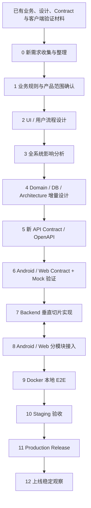

# BNBU Sports

面向学生、教师和管理员的校园体育系统。本仓库汇集 Android、Web、业务规则、数据库与架构设计、共享 API Contract，以及新一轮需求变更的团队协作入口。

**当前工作：收集并整理老师会议中的新需求。** 已有材料作为本轮变更的输入；实际会议内容尚待补充，团队暂不开始新功能实现。

- [当前进度](#当前进度)：各部分已经有什么、还缺什么。
- [目录与阅读入口](#目录与阅读入口)：加入团队后先读哪些材料。
- [后续开发路线](#后续开发路线)：从 0 到 12 的工作、产物和进入条件。
- [团队协作](#团队协作)：Owner、Reviewer、分支、测试和交接。
- [系统提示词与 AGENTS.md 模板](#系统提示词与-agentsmd-模板)：可以复用的工程约束与任务提示词。

## 当前进度

状态核对日期：**2026-09-02**。持续更新入口为 [STATUS.md](docs/rebuild/STATUS.md)。本节按系统组成说明实际情况。

| 部分 | 目前已经具备 | 尚未完成 / 下一步 |
|---|---|---|
| 新需求 | 已确定需求收集、规则确认、设计、实现、验收的工作路线 | 尚未收到本轮老师会议的具体需求；需要整理原话、来源、涉及角色和待确认问题，不能把路线本身当作已确认需求 |
| 业务规则 | 总流程、学生、教师、管理员四份权威文档已存在，覆盖角色权限、课程邀请、运动记录、审核、认证、成绩和管理职责 | 新需求尚未评审，尚未写入权威业务规则；只能以已确认规则作为现有设计依据 |
| UI / 用户流程 | 有 Android 学生端、Web 学生端，以及教师 / 管理员 Portal 的页面和交互代码 | 新需求对应的页面、入口、状态和权限反馈尚未设计；已有页面不能代替业务确认 |
| Domain / 数据库 | 已有领域模型、状态机、PostgreSQL 表与约束、事务、索引、审计和历史保留设计 | 这些是设计文档；当前 Backend 目录没有数据库实现或 migration，新需求影响的部分仍需增量设计 |
| Backend 架构 | 已有模块化单体、分层职责、模块 Owner、Repository Port、Mapper、事务和依赖规则 | 尚未落地服务骨架、Composition Root 或可执行的架构测试 |
| API Contract | 根 Contract 为 `1.2.0-contract` / `RC`，公开前缀 `/api/v1`；109 条路径、121 个操作、193 个 schema、66 个错误码 | 存在一个阻塞 CR：三组 discriminator 缺少显式映射。须评审、发布新 Version / SHA 并重新验证；当前 RC 不能直接作为无阻塞的实现或发布依据 |
| Android | 已有客户端与旧 API 清单；已有隔离的 Contract DTO 生成、序列化、非法输入拒绝和 Mock 验证记录；历史记录包含 341/341 单元测试通过、构建通过 | 正式网络链路仍绑定旧 `3.0.0-contract`；新 Contract 的验证绑定尚未替换正式运行链路，未接入本仓库真实 Backend，真机 E2E 尚未验收 |
| Web | 已有学生端和教师 / 管理员 Portal；已有 Contract / Mock、类型检查、构建和浏览器验证记录；历史记录包含 affected 13/13、Portal 125/125、Student smoke 79/79 | Portal 正式快照仍为 `3.0.0-web-snapshot`，新 Contract 验证与正式业务链路分离；仍有旧 API / DTO、演示数据和 `BACKEND_REQUIRED` 边界，需要按模块迁移 |
| Backend 实现 | `BNBU-Sports-Backend/` 的 Git 跟踪内容只有说明文件 | 尚无可启动服务、真实认证、业务 Use Case、数据库持久化或 COS 接入 |
| 联调 / 部署 | `infra/` 和 `tests/e2e/` 已预留文档入口 | 当前目录均只有说明文件；本次基线没有真实 Backend + PostgreSQL + 文件存储的 E2E、Staging 或 Production 验收证据 |
| CI | 仓库保留了一份 Backend CI workflow | [GitHub 实际运行失败](https://github.com/chchaiai/new_need_version_sports/actions/runs/33628771353)：安装依赖步骤无法进入不存在的 `backend/` 工作目录；另有旧工具与依赖路径待修复，需要独立任务恢复有效 CI |

上表测试数字来自仓库中已经提交的验证记录，本次 README 整理没有重跑 Android / Web 全量测试。历史结果、静态检查、Mock、真实服务联调和部署验收应分别记录。新需求可能使受影响的既有验证结果需要重跑。

当前 Contract 的 SHA-256：

```text
667ae751f3e623e3d603db4d68e6e9314d4b3fd6da433a1def8c36b81597d74a
```

详细证据：[Android 验证记录](docs/rebuild/handoffs/phase-5g-a-android-affected-contract-revalidation.md)、[Web 验证记录](docs/rebuild/handoffs/phase-5g-b-web-affected-contract-revalidation.md)、[Android 迁移清单](docs/rebuild/handoffs/android/legacy-migration-findings.md)、[Web 迁移清单](docs/rebuild/handoffs/web/phase-5db-legacy-migration-findings.md)、[阻塞 CR](contracts/change-requests/CR-20260901-005-explicit-discriminator-mappings.md)。

当前可推进的是需求收集和整理。进入实现前，需要确认业务范围、完成受影响设计、处理 Contract 阻塞，并让下游加载同一份有效版本。

## 目录与阅读入口

| 路径 | 用途 |
|---|---|
| [AGENTS.md](AGENTS.md) | 全仓库执行约束、写入范围、开始与结束报告、停止条件 |
| [docs/business/](docs/business/README.md) | 唯一业务规则权威：总流程、学生、教师、管理员 |
| [docs/architecture/](docs/architecture/README.md) | Domain / DB 设计、Backend 架构、模块边界与依赖规则 |
| [contracts/](contracts/README.md) | OpenAPI、元数据、生成源、校验脚本与 Contract CR |
| [BNBU-ANDROID/](BNBU-ANDROID/) | Android 客户端、Contract 验证和旧接口迁移材料 |
| [BNBU-Sports-Web-new/frontend/student/](BNBU-Sports-Web-new/frontend/student/) | Web 学生端 |
| [BNBU-Sports-Web-new/portal-teacher-admin/](BNBU-Sports-Web-new/portal-teacher-admin/) | 教师 / 管理员 Portal；工作前还需读取该目录的 AGENTS.md |
| [BNBU-Sports-Backend/](BNBU-Sports-Backend/README.md) | 后续 Backend 实现入口，目前为占位目录 |
| [infra/](infra/README.md) | 后续本地联调与部署基础设施入口 |
| [tests/e2e/](tests/e2e/README.md) | 后续跨客户端与真实服务的闭环验收入口 |
| [docs/rebuild/STATUS.md](docs/rebuild/STATUS.md) | 当前各部分情况、未完成项和推进条件 |
| [docs/rebuild/handoffs/](docs/rebuild/handoffs/README.md) | 每个任务的修改、测试、边界与交接记录 |

新成员按以下顺序阅读：`README → AGENTS.md → STATUS → 四份业务文档 → 相关架构与 Contract → 所负责模块的交接和迁移清单`。旧 API、旧 DTO、页面和 Mock 用于定位现状，不能用来补充业务决定。

## 后续开发路线

本轮统一从 **0** 开始编号。以下是后续工作计划，不代表已经完成。



### 0. 新需求收集与整理

只回答“老师具体提出了什么”。收集会议纪要、原话、截图和补充材料，去重但保留来源，为每条需求分配 `REQ-001`、`REQ-002` 等稳定编号。明确提出者、涉及角色、问题和待确认点。

产物为需求清单、来源索引和问题清单。具体会议资料尚未收到时保持待补充，不创造示例需求充当正式需求。本阶段不改产品代码、OpenAPI 或 Backend 设计。

可复制的需求记录模板：

```text
Requirement：REQ-<编号>
标题：
来源 / 会议日期 / 提出者：
原始表述：
涉及角色：
目前遇到的问题：
希望达到的结果：
待确认问题：
附件 / 证据：
业务决策：待下一步确认
```

**完成条件：** 已收到材料中的每项诉求都有来源和编号，遗漏、冲突和不明确之处均有记录。

### 1. 业务规则与产品范围确认

逐条明确谁能用、何时能用、允许和禁止什么、状态如何变化、异常如何处理、首版是否包含。每项 Requirement 最终登记为 `ACCEPTED`、`PENDING` 或 `REJECTED`，记录决定人和理由。

产物为需求决策表、首版范围、验收场景，以及经确认的四份业务文档增量。只有 `ACCEPTED` 内容可进入后续设计；核心 `PENDING` 未解决时停止推进受影响能力。

**完成条件：** 范围由人确认，核心规则无歧义，正常、异常和角色边界都能写出验收场景。

### 2. UI / 用户流程设计

依据已接受需求设计受影响的 Android / Web 页面、入口、跳转、操作和角色反馈。逐项覆盖正常、Loading、Empty、Error、无权限、维护模式，以及中断后的恢复体验。

产物为页面清单、用户流程图、状态矩阵和可评审原型。原型使用的演示数据必须标明用途，不接入真实 API，也不据此决定新字段或业务规则。

**完成条件：** 学生、教师和管理员如何完成任务已明确，页面与需求可互相追溯。

### 3. 全系统影响分析

逐条建立 `Requirement → UI → Use Case → Domain → Database → Contract → Backend → Android / Web` 的对应关系；标出新增、修改、删除、不受影响以及尚待分析的部分。

Impact Matrix 至少使用以下列。`待评估` 不等于“不受影响”：

| Requirement | UI | Use Case | Domain | Database | Contract | Backend | Android | Web | Owner / 风险 |
|---|---|---|---|---|---|---|---|---|---|
| REQ-<编号> | 待评估 | 待评估 | 待评估 | 待评估 | 待评估 | 待评估 | 待评估 | 待评估 | 待分配 |

产物还包括工作拆分、依赖顺序、数据兼容风险和测试影响。**完成条件：** 每条接受的需求都有影响结论和负责人，可以据此圈定各任务允许修改的路径。

### 4. Domain / Database / Architecture 增量设计

只更新受需求影响的模型、状态机、不变量、字段、唯一约束、事务、索引和模块边界。保留已成立的架构责任；设计数据库变更时区分空库初始化与已有数据迁移，说明迁移、回填和回滚条件。

产物为设计差异、数据变更方案、模块责任与 Mapper / 事务边界。业务变化必须有 `ACCEPTED Requirement` 支持，不从旧字段或旧接口反推业务。

**完成条件：** 设计可以支撑 Use Case 与 UI，数据保留、并发、约束和迁移风险经过评审。

### 5. 新 API Contract / OpenAPI

将已确认 Use Case、UI 数据需求和 Domain / DB 能力转为共享协议。明确 Method、Path、operationId、RequestDTO、ResponseDTO、状态码、错误、认证、权限、分页、幂等、并发、时间、null 与上传规则。

处理现有 [discriminator 阻塞 CR](contracts/change-requests/CR-20260901-005-explicit-discriminator-mappings.md) 和本轮发现的真实 Contract 缺口。变更先经过 CR 与下游影响评审，再通过生成源发布新的 Contract RC、Version 和 SHA；具体版本号按实际变更决定，不原地覆盖既有基线。

**完成条件：** 协议可生成、可验证、可追溯；仍待客户端验证的事项明确列出，不能把结构 lint 通过等同于跨生成器兼容。

### 6. Android / Web Contract + Mock 验证

拆分为 **6A Android** 和 **6B Web**，两端精确锁定同一 Version / SHA。检查页面需要的数据、空状态、错误、DTO 生成、枚举、null、序列化和非法值拒绝；验证双方对同一字段和状态的理解一致。

| 发现的问题 | 处理路径 |
|---|---|
| Contract defect | 提交 CR；修订版本后重新加载并验证 |
| Legacy issue | 登记 Legacy Migration Finding，留给正式接入任务 |
| 客户端实现问题 | 登记 Client Defect，在获准范围内修复 |
| 业务不明确 | 返回 1，由业务负责人决定 |

最后进行统一 Contract Consolidation；若协议变化，两端重新生成并重跑受影响验证。**完成条件：** 阻塞 CR 为零、三组 discriminator 的实际 wire 值验证通过、两端绑定一致，才进入 Backend 实现。Mock 通过只证明该验证范围。

### 7. Backend 垂直切片实现

在业务、设计和 Contract 门禁满足后，按模块逐片实现。每个大模块单独建立任务与 AI 对话，再拆成可评审的小任务。

| 子任务 | 工作范围 |
|---|---|
| 7.0 Backend Foundation | 确认技术栈、最小 Composition Root、配置与错误边界、数据库连接、健康检查和架构测试；同步修复与新目录不匹配的 CI |
| 7.1 Auth / Identity | 身份、会话、权限、本人密码与账号状态 |
| 7.2 Course / Enrollment | 课程、有效邀请、加入与成员关系 |
| 7.3 Exercise Session | 运动状态机、计时事实、完成和异常边界 |
| 7.4 Media / Record | 上传分配、确认、正式记录提交与资源归属 |
| 7.5 Review / Statistics | 责任教师审核、历史与当前结果、统计投影 |
| 7.6 Admin / 其他已确认模块 | 按范围补齐管理能力和新需求涉及的模块 |

业务调用通过 `API → Application / Use Case → Domain` 执行，持久化通过 `Application 的 Repository Port → Infrastructure → PostgreSQL / COS` 完成。运行时调用关系不等于源码依赖方向：Domain 不依赖数据库或框架，API 不越过 Application 直接操作 Domain / 数据库，具体适配器由 Composition Root 装配。

遵守 [架构职责](docs/architecture/backend-architecture.md)、[模块边界](docs/architecture/backend-module-boundaries.md) 和 [依赖规则](docs/architecture/backend-dependency-rules.md)。分别维护 Contract DTO、Application 模型、Domain 模型与 Persistence 模型，显式映射；事务由 Use Case 协调，业务事实与必要审计原子提交。

**每片完成条件：** 对应操作具备真实持久化，权限、异常、并发、幂等和 Contract conformance 有测试；Owner / Reviewer 确认后交付客户端接入。仅建立空类或空接口不算模块完成。

### 8. Android / Web 分模块接入

Backend 哪个模块完成，就迁移该模块的 Android / Web 调用，例如 Auth 完成后先接两端 Auth，再接 Course。

```text
新 API → Mapper / Adapter → Repository 切换 → 真实 Backend 验证 → 删除该模块旧 API
```

在这里逐项消化 Legacy Migration Findings，验证真实网络、会话、权限、错误与 UI。**每片完成条件：** 正式业务路径使用新协议，迁移清单有关闭证据，无静默 old/new fallback；只删除已完成迁移范围内的旧接口。

### 9. Docker 本地 E2E 联调

建立 Android / Web → 真实 Backend → 真实 PostgreSQL → 测试 COS / 文件存储的链路。验收登录、加入课程、开始与完成运动、上传、提交、责任教师查看 / 审核、学生查看结果和管理员统计的完整闭环。

同时覆盖异常、越权、网络中断、并发提交、重复请求和幂等，验证迁移与可重复初始化。**完成条件：** 测试环境和数据可复现，核心闭环与异常结果有证据，Mock 不混入正式验收链路。

### 10. Staging 验收

部署 HTTPS、Nginx、Backend、PostgreSQL、COS 与 Web，在 Android 真机和真实浏览器上验收；检查日志、监控、备份、恢复和回滚。

进入前 Contract 须达到仓库治理要求的 `APPROVED` 状态。**完成条件：** 类生产配置下功能、权限、安全、关键性能和恢复能力通过，由指定的人完成上线前 Review，发布阻塞项关闭。

### 11. Production Release

冻结 Git SHA、Contract Version / SHA、migration、Docker Image Digest、Web Build 和 Android Build；Contract 使用 `LOCKED` 生产基线，保存发布、回滚和数据操作清单。

**上线阶段只部署已经验收的产物。** 发现需改代码的问题时返回独立修复任务，重新测试并通过 Staging。

**完成条件：** 获得发布授权，按清单执行部署与冒烟验证，可定位每个产物并执行回滚。

### 12. 上线稳定观察

观察 5xx、登录失败、数据库连接与慢查询、上传失败、权限异常、客户端崩溃、审核闭环和备份结果。上线前由团队明确观察窗口、阈值、值班责任和升级方式。

```text
发现 Bug → Issue → 独立修复任务 → 测试 → Staging → Patch Release
```

**完成条件：** 约定观察窗口内达到验收指标，遗留问题有 Owner 与处理计划，运行维护完成交接。

## 团队协作

每个小任务必须绑定：

```text
一个 Owner（人）
+ 一个 Reviewer（人）
+ 一个 Branch / Worktree
+ 一个 AI 对话
+ 一个明确修改范围
+ 一个测试标准
+ 一个 Handoff
```

Owner 对需求、方案和交付负责，Reviewer 对审查结论负责。AI 协助分析、执行和验证，不代替人的业务决定与验收。

```text
人理解需求与架构 → 人与 AI 讨论任务 → 人批准执行方案
→ AI 执行 → 人监督 → AI 测试 → 人 Review → 存档 → Merge
```

分支可使用 `codex/<任务名称>`。同一小任务只设一个写入负责人；多人并行时明确各自路径，并指定状态文档汇总人。不要让不同任务同时改同一份共享文件。使用已有授权完成范围内工作；发现新增范围或缺少业务决定再升级处理。

PR 应说明具体问题、最终行为、影响范围、测试结果、未执行项和 Handoff。一次本地 commit、创建 PR、Merge、部署分别记录；没有发生的动作不标成完成。

## 系统提示词与 AGENTS.md 模板

长期仓库规则放在根 [AGENTS.md](AGENTS.md)，每个任务再提供目标、输入、写入范围和验收标准。Codex 支持仓库级和目录级的 `AGENTS.md` 指令；建议保留这个准确文件名。参见 [OpenAI 官方 AGENTS.md 文档](https://learn.chatgpt.com/docs/agent-configuration/agents-md)。

本仓库根 AGENTS.md 是实际执行规则。以下是便于团队复用的模板，引用四份业务文档，不在提示词中另写一套业务规则。

### 核心原则

1. **先明确任务，再动文件。** 开始报告 Git 状态、权威输入、允许路径、禁止路径与完成标准。
2. **业务决定由人做。** 未明确的规则登记 `PENDING`，只让 `ACCEPTED` 需求进入设计和实现。
3. **Contract 是共享边界。** 缺口走 CR、影响评审、版本与 SHA 更新，下游重新加载；不在客户端或 Backend 私造字段。
4. **写入范围明确到路径。** 可以跨目录只读检索，超出获准写入范围时停止并提交范围变更请求。
5. **验证结论带证据。** 区分文档、静态检查、单测、Mock、真实服务、E2E、Staging、Production，明确未执行项。
6. **任务可交接。** 结束同步状态与 Handoff，写明残留问题、责任和下一步条件，保护已有工作。

### 可复用的 AGENTS.md 模板

```markdown
# 仓库执行规则

## 权威输入
- 每次任务先读根 AGENTS.md、相关目录 AGENTS.md、docs/rebuild/STATUS.md 和最新相关 Handoff。
- 业务规则仅以 docs/business/00-overview.md、10-student-flow.md、20-teacher-flow.md、30-admin-flow.md 为准。
- 技术任务按需读取 docs/architecture/、contracts/openapi.yaml 与 contract-metadata.json。
- 旧 API、DTO、Mock 和现有实现不是业务决策来源。

## 开始报告
- Git 根目录、分支、HEAD、git status、已读取的 AGENTS.md。
- 当前任务 / 阶段、Owner、Reviewer、允许修改路径、禁止修改路径、完成标准。
- 先核查再执行；保护已有修改，不自动 stash、reset、clean 或强制切换分支。

## 执行边界
- 可以跨目录只读检索，只能写入任务明确允许的路径。
- 业务不明确：停止受影响实现，登记 PENDING，等待业务负责人决定并更新业务文档。
- Contract 不够用：停止受影响实现，提交 CR，评审后更新版本与 SHA，再由下游重新加载。
- 必须超出写入范围：停止越界修改，说明原因并提交范围变更请求，另开对应模块任务。
- 不以 Mock、TODO、空接口或 Fake Success 交付正式业务能力。
- 已有授权继续适用；新增发布、Merge 或部署动作须有对应授权。

## 结束报告与交接
- 完成状态：DONE / PARTIAL / BLOCKED。
- 修改文件、执行测试、真实结果、未执行测试及原因。
- 是否修改业务规则、是否修改 Contract。
- 旧 API、Mock、TODO、空接口是否仍存在，影响哪个范围。
- 下一阶段前置条件和需要人决定的问题。
- 更新 docs/rebuild/STATUS.md 与 docs/rebuild/handoffs/。
- 区分本地提交、PR、Merge 与部署结果；不得报告未经验证的完成状态。
```

### 每个任务的启动提示词

将下面内容补全后用于一个独立 AI 对话。允许路径应包含本任务的状态与 Handoff 文件；纯审查任务如果禁止写入，应明确改为输出交接内容供 Owner 落档。

```text
任务名称：<具体小任务>
阶段：<0–12 中的一项，或 6A / 6B / 7.x 子任务>
关联需求：<REQ 编号；没有正式需求时写待收集>
Owner：<人名>
Reviewer：<人名>
仓库 / 分支 / Worktree：<确切位置>

请先读取根 AGENTS.md、相关目录 AGENTS.md、docs/rebuild/STATUS.md，
以及以下权威输入：<业务、设计、Contract、Handoff 的确切路径>。
涉及 Contract 时核对 Version / Status / SHA：<填写本次锁定值>。

本轮目标：<一个可验收结果>
允许修改：<明确文件或目录，包括状态与本任务 Handoff>
禁止修改：<明确路径；其余未授权路径也不能写入>
本轮可以跨目录只读检索，但不能自行扩大写入范围。

已批准的执行范围：<写清已授权工作，避免每步重复确认>
尚需人决定的问题：<没有则写无>
计划执行的测试：<命令 / 场景 / 环境>
完成标准：<可核对的结果>
Git 与发布授权：<例如只读 / 本地提交 / push 并建 PR；明确是否允许 Merge 或部署>

开始先报告 Git 根目录、分支、HEAD、状态、读取的规则、任务范围与完成标准。
业务不明确、Contract 缺口或需要跨目录写入时，按 AGENTS.md 停止受影响工作并说明。
结束报告真实结果、未执行项、旧 API / Mock / TODO / 空接口和下一步条件，
同步本任务获准的 STATUS 与 Handoff，不将静态或 Mock 结果写成真实服务验收。
```

### Handoff 应留下什么

Handoff 至少记录任务与需求编号、Owner / Reviewer、开始时的 Git / Contract 基线、修改路径、测试命令及结果、未执行项、业务和 Contract 是否变化、旧接口与占位内容、已知问题、下一步前置条件。失败命令也要保留结论，不能只列成功结果。

对于当前需求收集工作，下一份有效输入是老师会议材料。先把需求说清楚，再按本页路线推进设计和实现。
